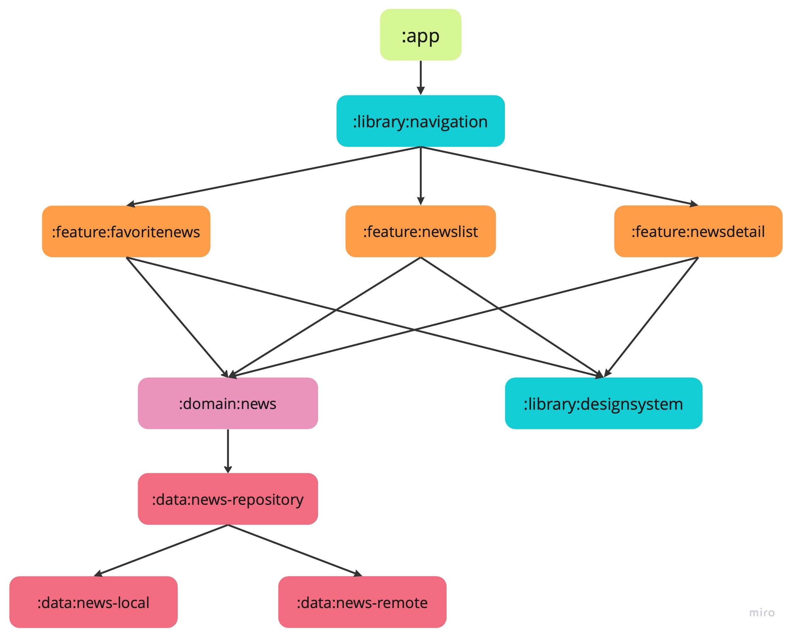
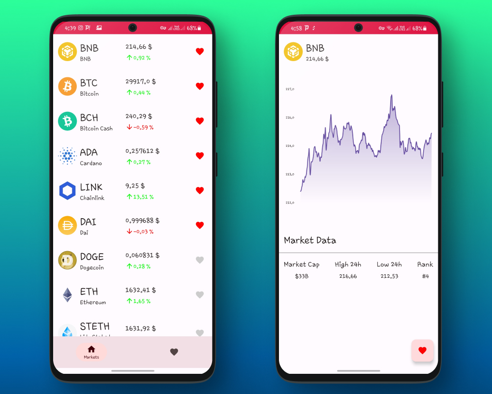
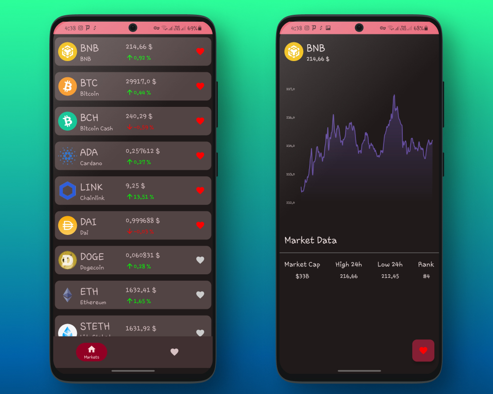
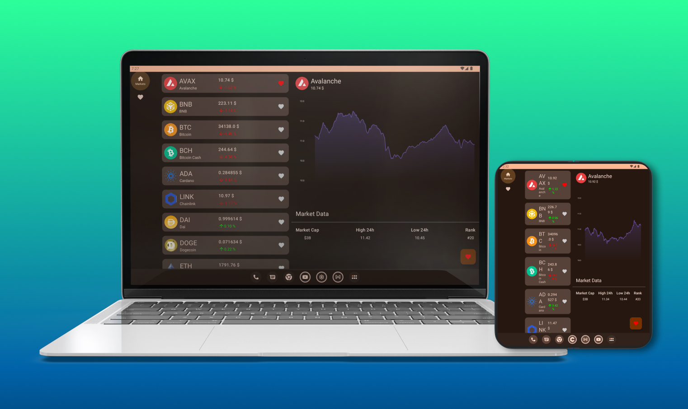

# ComposeNews

This repo is a playground about best practices, using updated libraries and solutions in the Android world!

Check the apk [from here](asset/app_v1.0.0.apk)

## ⚙️ Architecture

The main architecture of code based on MVI + CLEAN architecture. The division criteria is a hybrid strategy based on Feature + Layer by module.
For the detail of architecture, please read [this article](https://medium.com/@kaaveh/migrate-from-mvvm-to-mvi-f938c27c214f).

## 🚦 Navigation

For the detail of navigation implementations, please read [this article](https://proandroiddev.com/all-about-navigation-in-the-jetpack-compose-based-production-code-base-902706b8466d).

## 📱 Previewing

For the detail of handling preview of composable functions in this code-base, please read [this article](https://proandroiddev.com/an-introduction-about-preview-in-jetpack-compose-b72a96daac35).

## 🛠 Technologies

- Jetpack Compose
- CLEAN architecture
- MVI architectural pattern
- Coroutine Flow
- SQLDelight database
- Dagger Hilt
- Navigation
- Ktor client
- Work manager
- Unit test
- Support large screens
- Monochromatic app icon
- Version catalog & Convention Plugin (For the detail, please read [this article](https://proandroiddev.com/mastering-android-dependency-management-b94205595f6b))
- CI
- Git Hooks
- GitHub Actions
- Static Analysis(Kotlinter, Detekt) (For the detail, please read [this article](https://blog.kotlin-academy.com/detekt-gradle-configuration-guide-d6d2301b823a))

### We are porting the project to KMP. Here's the steps:
- [x] GSON &rarr; Kotlinx Serialization
- [x] ROOM &rarr; SQLDelight
- [x] Retrofit &rarr; Ktor
- [x] JUnit &rarr; Kotest
- [ ] Dagger-Hilt &rarr; Koin
- [ ] Jetpack Compose &rarr; Compose Multiplatform

## 📸 Screenshots

### Light theme

### Dark theme

### Dynamic theme

### Large screen support (Foldable, Tablet, and Desktop)

## Additional Resources

- [Git Hooks](documentation/GitHooks.md) - Learn about Git hooks used in this project for code formatting and analysis.
- [GitHub Actions](documentation/GitHubActions.md) - Explore the GitHub Actions workflows used to validate the code.
- [Static Analysis](documentation/StaticAnalysis.md) - Discover how static analysis tools like Detekt and Ktlint are used in this project for code quality assurance.

## 🤝🏻 Contribute

Any PRs are very welcome! 😍 You can fix a bug, add a feature, optimize performance and even propose a new cool approach in code-base architecture. Feel free and make a PR! 😌

We use static analysis tools like Detekt and Ktlint in this project. Please either set up [Git Hooks](documentation/GitHooks.md) on your project or run [Static Analysis](documentation/StaticAnalysis.md) before creating PR.
