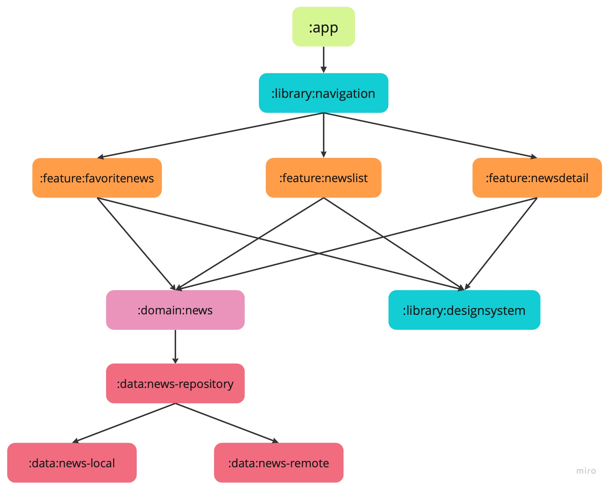
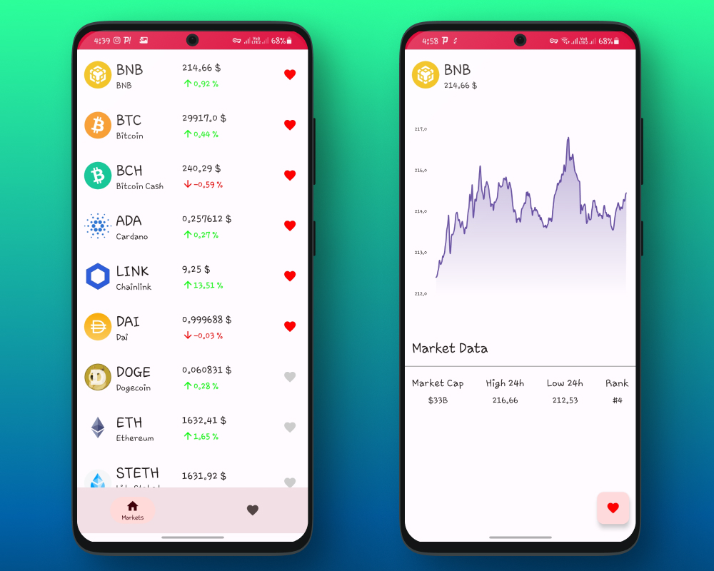
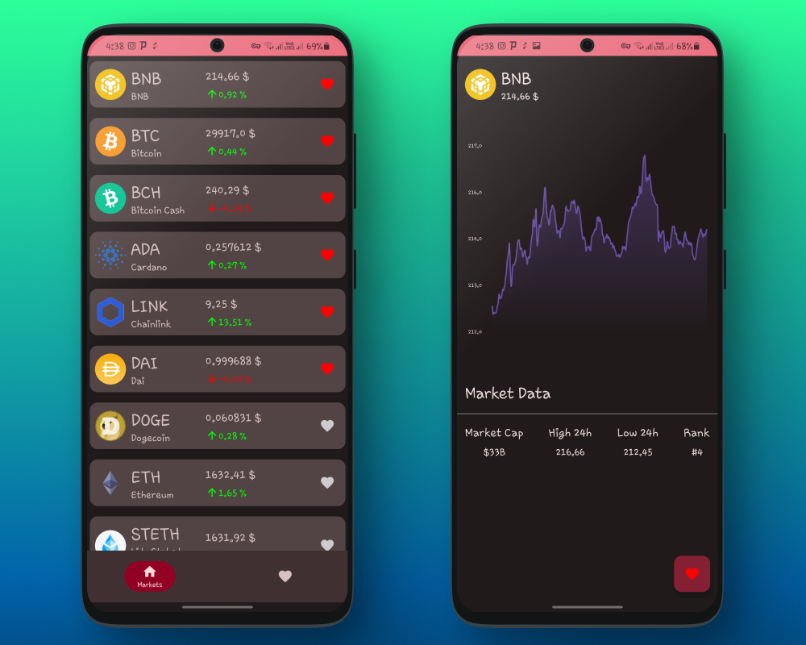
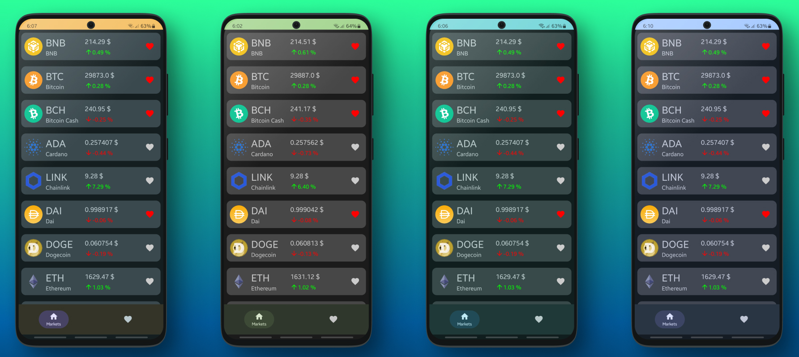
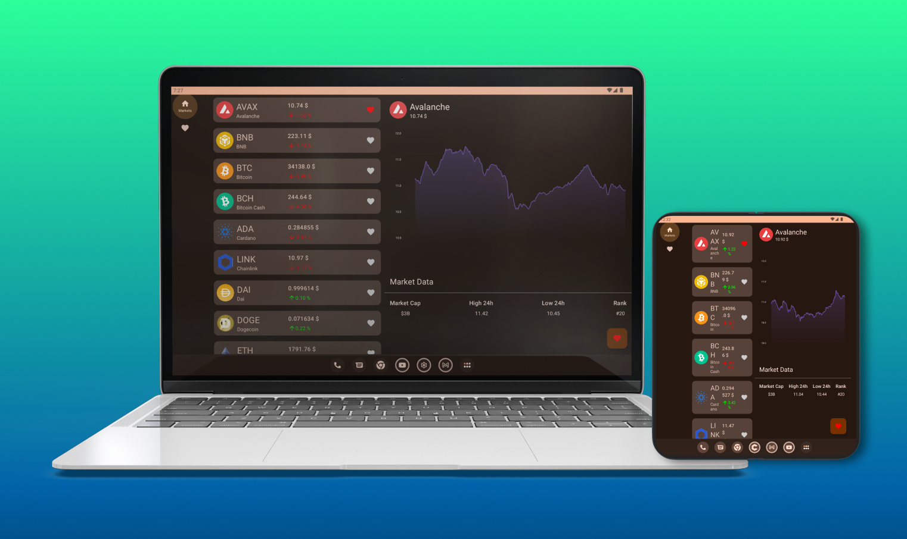
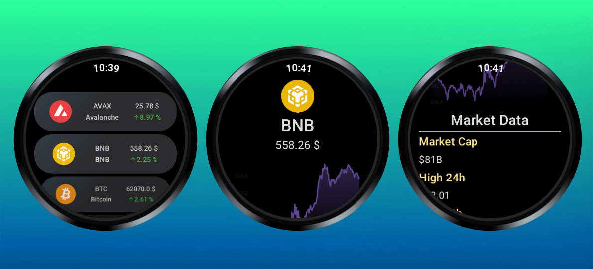

# ComposeNews


This repo is a playground about best practices, using updated libraries and solutions in the Android world!

Check the app apk [from here](asset/app_v1.0.0.apk)

## ⚙️ Architecture



The main architecture of the code is based on MVI + CLEAN architecture. The division criteria is a hybrid strategy based on Feature + Layer by module.
For the details of architecture, please read [this article](https://medium.com/@kaaveh/migrate-from-mvvm-to-mvi-f938c27c214f).

## Wear OS
This project includes a WearOS module for Android-based smartwatches like the Galaxy Watch. The `app-watch` module contains `app`, `designsystem`, `navigation`, and `ui` submodules. You can build the `app-watch:app` to have a wearOS version of the application.

## 🚦 Navigation

For the details of navigation implementations, please read [this article](https://proandroiddev.com/all-about-navigation-in-the-jetpack-compose-based-production-code-base-902706b8466d).

## 📱 Previewing

For the details of handling the  preview of composable functions in this code-base, please read [this article](https://proandroiddev.com/an-introduction-about-preview-in-jetpack-compose-b72a96daac35).

## 🛠 Technologies

- Jetpack Compose
- CLEAN architecture
- MVI architectural pattern
- Coroutine Flow
- SQLDelight database
- Dagger Hilt
- Navigation
- Ktor client
- Work manager
- Unit test
- Support large screens
- Support WearOS devices
- Monochromatic app icon
- Version catalog & Convention Plugin (For the details, please read [this article](https://proandroiddev.com/mastering-android-dependency-management-b94205595f6b))
- CI
- Git Hooks
- GitHub Actions
- Baseline and Startup Profiles
- Static Analysis(Kotlinter, Detekt) (For the detail, please read [this article](https://blog.kotlin-academy.com/detekt-gradle-configuration-guide-d6d2301b823a))

### We are porting the project to KMP. Here are the steps:
- [x] GSON &rarr; Kotlinx Serialization
- [x] ROOM &rarr; SQLDelight
- [x] Retrofit &rarr; Ktor
- [x] JUnit &rarr; Kotest
- [x] Dagger-Hilt &rarr; Koin
- [ ] Jetpack Compose &rarr; Compose Multiplatform

## 📸 Screenshots

### Light theme



### Dark theme



### Dynamic theme



### Large screen support (Foldable, Tablet, and Desktop)




### WearOS devices (Android-based smartwatches)


## 🚀 Baseline Profiles and startup benchmarks

The `baselineprofile` module generates Baseline and Startup Profiles for the app and measures their
effect on cold startup. Profile generation and benchmarks use the `fixture` backend flavor, which
returns deterministic market data and avoids depending on the rate-limited production API. The
`live` flavor continues to use the production backend.

Fixture-only implementation classes are excluded from generated profile rules. The resulting
profiles are merged into the main source set and packaged with the production release:

```text
app/src/main/generated/baselineProfiles/baseline-prof.txt
app/src/main/generated/baselineProfiles/startup-prof.txt
```

### Generate the profiles

Start an API 33+ emulator or connect an API 33+ physical device, then run:

```bash
ANDROID_SERIAL=<device-serial> ./gradlew :app:generateBaselineProfile
```

Use `adb devices -l` to find the device serial. Profile generation can run on an emulator, but
performance benchmarks should run on a physical device.

### Measure startup performance

Run the cold-start benchmarks on a physical device:

```bash
ANDROID_SERIAL=<device-serial> \
./gradlew :baselineprofile:connectedFixtureBenchmarkReleaseAndroidTest
```

The benchmark compares startup with no compilation against startup with the generated Baseline
Profile. It records:

- **TTID (Time To Initial Display):** time until the first activity frame is rendered.
- **TTFD (Time To Full Display):** time until market content is loaded and the screen reports that
  it is fully drawn.

Results and Perfetto traces are written under:

```text
baselineprofile/build/outputs/connected_android_test_additional_output/
```

### Reference result

The following result was measured over 20 cold-start iterations on a physical Samsung SM-S731B
running Android 16 (API 36):

| Metric | No profile | Baseline Profile | Improvement |
|---|---:|---:|---:|
| Median TTID | 294.4 ms | 263.6 ms | 10.5% faster |
| Median TTFD | 428.2 ms | 340.8 ms | 20.4% faster |

Benchmark numbers are device-specific and should primarily be used to detect regressions and
compare changes under the same test conditions.

## Additional Resources

- [Git Hooks](documentation/GitHooks.md) - Learn about Git Hooks used in this project for code formatting and analysis.
- [GitHub Actions](documentation/GitHubActions.md) - Explore the GitHub Actions workflows used to validate the code.
- [Static Analysis](documentation/StaticAnalysis.md) - Discover how static analysis tools like Detekt and Ktlint are used in this project for code quality assurance.

## Compose compiler metrics

Run the following command to get and analyse compose compiler metrics:

```bash
./gradlew assembleRelease -PenableComposeCompilerMetrics=true -PenableComposeCompilerReports=true
```

## 🤝🏻 Contribute

Any PRs are very welcome! 😍 You can fix a bug, add a feature, optimize performance, and propose a new cool approach in code-base architecture. Feel free to make a PR! 😌

We use static analysis tools like Detekt and Ktlint in this project. Please either set up [Git Hooks](documentation/GitHooks.md) on your project or run [Static Analysis](documentation/StaticAnalysis.md) before creating PR.
